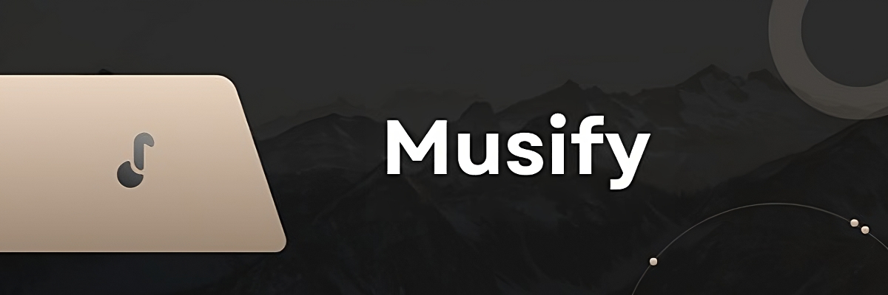
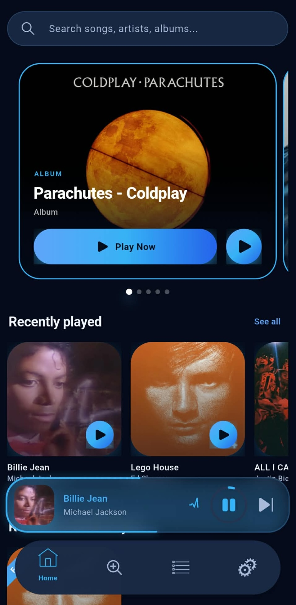
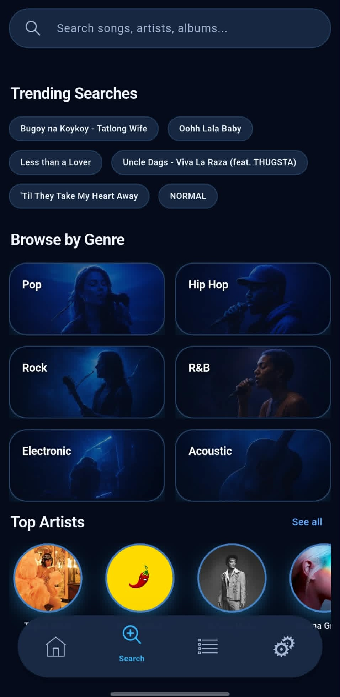
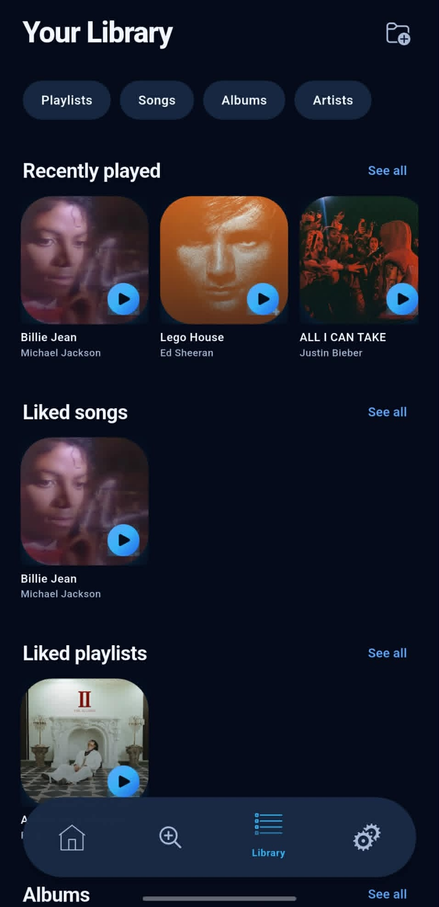
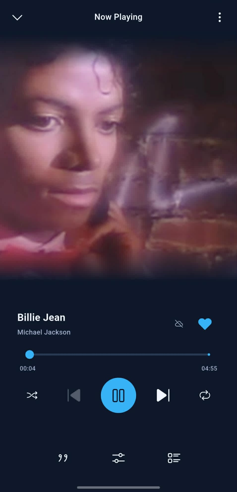
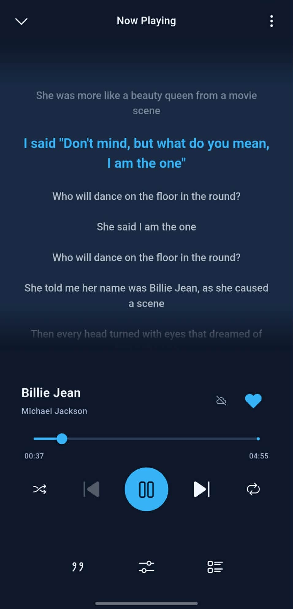
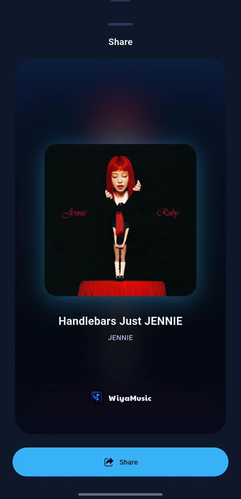
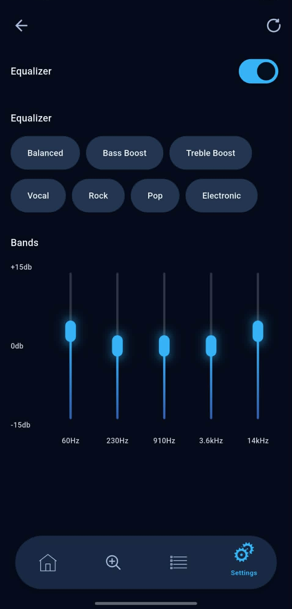

# WiyaMusic 🎵

<p align="center">
  
</p>
<p align="center">
  <b>Unlock the Rhythm: Your Ultimate Music Companion!</b>
</p>

<p align="center">
  <a href="https://github.com/Wiyam12/wiyamusic/releases/latest">
    
  </a>
  <a href="https://github.com/Wiyam12/wiyamusic/stargazers">
    
  </a>
  <a href="https://github.com/Wiyam12/wiyamusic/blob/master/LICENSE">
    
  </a>
  <a href="https://github.com/Wiyam12/wiyamusic/commits">
    
  </a>
</p>

<p align="center">
  <a href="https://github.com/Wiyam12/wiyamusic/releases/latest">
    
  </a>
</p>

## Screenshots

<p align="center">
  
  
  
  
</p>
<p align="center">
  
  
  
</p>

## Download

<p align="center">
  <a href="https://github.com/Wiyam12/wiyamusic/releases/latest">
    
  </a>
</p>

## Features

- Play songs (Online and Offline)
- Gapless Playback
- Search songs, albums, artists, and playlists
- Trending songs
- Support for two languages: English and Spanish
- Add songs to favorites list
- Playlists support
- Import & export playlists (JSON, CSV, YouTube)
- Edit song picture and name
- Dynamic theme support
- Custom equalizer
- Loudness normalization
- Sleep timer
- Audio device matching
- Lyrics support
- No ads
- No subscription
- No login required
- Sponsored free

## Contribute

WiyaMusic welcomes contributions!

1. Fork the repository
2. Create a new branch: `git checkout -b my-feature-branch`
3. Make your changes and commit them: `git commit -am 'Add some feature'`
4. Push the changes to your fork: `git push origin my-feature-branch`
5. Submit a pull request

## FAQ

<details>
<summary><b>Q: I can't find my music language in the app</b></summary>

You can use the search feature to find music in your preferred language. The app also supports exploring music by genre and artist.

</details>

<details>
<summary><b>Q: There are problems with song titles or lyrics</b></summary>

Song titles and lyrics come from YouTube Music / Genius. WiyaMusic cannot correct this data directly. If you find issues, please report them to YouTube Music or Genius.

</details>

<details>
<summary><b>Q: There are no results for my search</b></summary>

WiyaMusic uses YouTube Music for search. If YouTube Music returns no results, WiyaMusic cannot show any. You can try searching for the same query on YouTube Music to verify.

</details>

<details>
<summary><b>Q: Why does WiyaMusic require a battery optimization exemption?</b></summary>

Android's battery optimization can interrupt background media playback. Disabling it for WiyaMusic helps ensure uninterrupted listening.

</details>

<details>
<summary><b>Q: Can I customize the app's theme?</b></summary>

Yes. WiyaMusic supports dynamic theming and accent colors.

</details>

<details>
<summary><b>Q: How do I import or export playlists?</b></summary>

Go to the Library section. You can import/export playlists as JSON or CSV, and also import playlists from YouTube.

</details>

<details>
<summary><b>Q: How do I report a bug or suggest a feature?</b></summary>

Open an issue on [GitHub](https://github.com/Wiyam12/wiyamusic/issues).

</details>

## Credits

WiyaMusic is based on [Musify](https://github.com/gokadzev/Musify) by [gokadzev](https://github.com/gokadzev). Many thanks for the original work.

## License

```
WiyaMusic is a free, open-source Flutter music client for personal use.
This project is a fork of Musify (https://github.com/gokadzev/Musify),
originally created by Tornike G. (gokadzev), and is licensed under the
GNU General Public License v3.0 or later (GPL-3.0-or-later).

Copyright (C) 2026 WiyaMusic Contributors
Copyright (C) 2021-2025 Tornike G. (gokadzev)

This program is free software: you can redistribute it and/or modify
it under the terms of the GNU General Public License as published by
the Free Software Foundation, either version 3 of the License, or
(at your option) any later version.

This program is distributed in the hope that it will be useful,
but WITHOUT ANY WARRANTY; without even the implied warranty of
MERCHANTABILITY or FITNESS FOR A PARTICULAR PURPOSE. See the
GNU General Public License for more details.

You should have received a copy of the GNU General Public License
along with this program. If not, see <https://www.gnu.org/licenses/>.

Additionally, this application is provided solely for private, non-commercial use.
You may not use this application for any commercial purposes without prior written
permission from the copyright holders.
```

## Disclaimer

```
WiyaMusic is not affiliated with, endorsed by, or sponsored by YouTube,
YouTube Music, Google LLC, Genius Media Group Inc., or any of their affiliates
or subsidiaries. All trademarks and copyrights belong to their respective owners.

WiyaMusic does not host, store, or distribute any media content. All music,
artwork, and metadata are retrieved from publicly available third-party sources.
Users are solely responsible for ensuring their use of this application complies
with applicable laws and the terms of service of any third-party platforms.

By using WiyaMusic, you acknowledge that you do so at your own risk, and the
developers assume no liability for any misuse or legal consequences arising from
its use.
```
